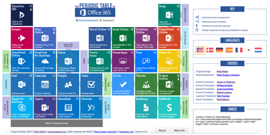

## HEXATOWN DOCUMENTS
This is the place for sharing usecases and technival documentation.

- Vendor > Technology > 
- _Usecases 

## Support "the PERIODIC TABLE of Office 365" with insights

Visit this awesome tool [the PERIODIC TABLE of Office 365](http://periodictableofoffice365.azurewebsites.net/#/office365/en)

## Todos
- [x] Everything has been done (-; !
- [x] Add top level folder structure resembling Offic365 admin centers
- [x] List blog posts on frontpage
- [x] jekyll-now integrated
- [ ] Consider https://www.gov.uk/service-manual/agile-delivery/writing-user-stories#meeting-the-digital-service-standard
- [ ] add Search
- [ ] Write article on how to work with Markdown and Git 

## Jekyll
Jekyll is used for rendering this site and is automatically updated on (http://365admin.net/docs)

- [Variables] (https://jekyllrb.com/docs/variables/)