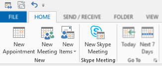
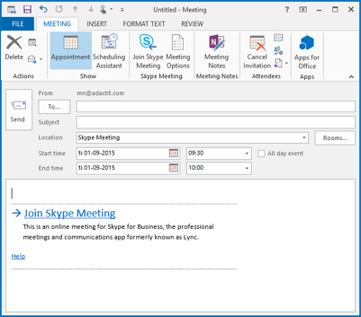
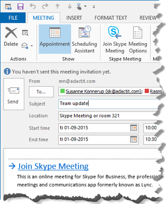
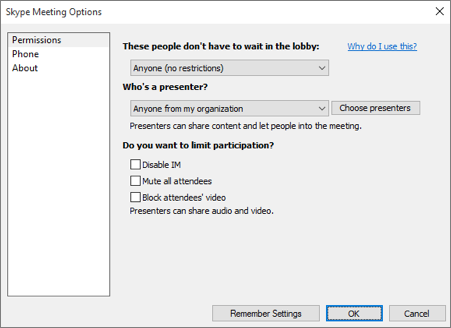

  
# Plan an Online Meeting

Open your Outlook calendar and click New Skype Meeting (home tab)

Location is prefilled as Skype Meeting. 

Information and link is automatic put in description.

Fill out the meeting request as you are used to.

# Set Meeting Options

Choose presenters
- Set attendee limitations
- Deactivate chat 
- Deactivate microphones
- Deactivate video (webcams) 

>You decide who to invite directly into the meeting and who to wait until you let them in. We recommend that you change these settings to large meetings, or when you have confidential or sensitive information

Use the Lobby to control access 
- Choose presenters
- Set attendee limitations
- Deactivate chat  (Instant Messaging)
- Deactivate microphones
- Deactivate video (webcams