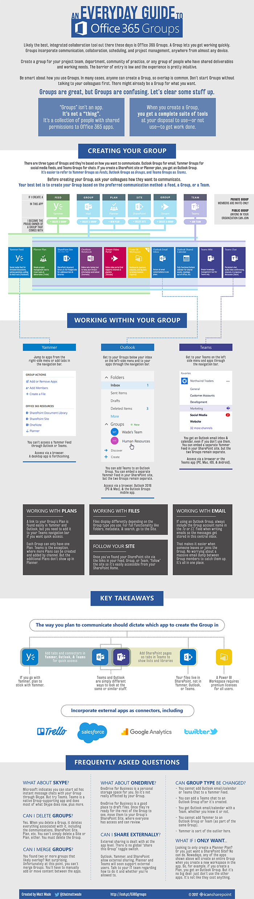

*You all seemed to like my coverage of the *[Periodic Table of Office
365](http://icsh.pt/O365Table)*, so thanks a bunch for that. But the biggest
comment on that post was, “What about Groups?” Well, Groups aren’t an app, so
they aren’t part of that graphic. So instead, I’m covering Groups separately
here.*

 

On a user level, Office 365 Groups—which I’ll simply refer to as the capitalized
Groups in this article—are one of the biggest selling points for moving to
Office 365. They provide quick, easy access to an online workspace for
communicating with colleagues and collaborating on documents and files. There’s
little-to-no learning curve: get in and start working.

 

But they’re also one of the most confusing new things in Office 365. Why?
Because few people (even in my field) can explain Groups well… or correctly.
“Groups” is also not an app. You’re not going to find it in the Waffle, which
confuses… everybody.

 

This makes things difficult because Groups is more a *concept* or
an *experience* than it is a *thing*. For example, you don’t access a Group
through a standard “Groups” web interface: you can get there through Outlook,
Yammer, Teams, or elsewhere. Below is an infographic to get you started with
Groups. And below that is some more detailed coverage of what the infographic
means.

 

 

What a Group actually is
------------------------

Simply put, an Office 365 Group is a collection of people. It’s basically an
upgraded version of an Outlook distribution group; you know, like if you
email <accounting@company.com>, that email gets forwarded to all of accounting?
It’s basically the same thing.

 

But that’s not the *experience *you get when you work with a Group. Once you
create the Group (the collection of people), it tips the first domino of a
series that provide you a suite of Office 365 apps that you can use to
communicate and collaborate.

 

So no, it’s not an app. A Group has no standard interface. You won’t find “it”
in the Waffle. “Groups” is—in the way you’ll experience it in everyday work
life—a generalized collaborative experience in O365.

 

How a Group works
-----------------

There are three main types of Groups, and they’re created based on the way your
Group wants to *communicate*. You can have 1) an Outlook Group, 2) a Yammer
Group, or 3) a Teams Group. There is overlap between some of these I’ll cover
later in this article.

 

Generally, the way you refer to your Group will depend how it was created:

1.  Outlook Groups are called… Outlook Groups. In fact, there’s even an iOS app
    for them called (wait for it) Outlook Groups.

2.  Yammer Groups are generally called Groups or Feeds (your call).

3.  A Group in Teams is pretty much known only as a Team.

But just remember that a Yammer Feed and a Team are really Groups behind the
scenes! The Group is about permissions; the apps are about doing work. That’s
why Groups get confusing: depending on which app you’re using to access them,
you might use a different vernacular to reference them.

 

So, you now know that **your communication channel is key** when deciding on
which type of Group you want. But when you create a Group, it doesn’t just
create a communication channel, it also provides you other workspaces. And you
get them whether you like it or not. You decide whether to use—or not use—these
apps. There’s nothing saying you have to use them all, but you can’t create just
a Yammer Feed without, say, a SharePoint site collection.

 

Let’s take this one by one so you know what you get when you create a Group in
Outlook, Yammer, or Teams.

 

Outlook Group
-------------

When you create an Outlook Group, you get:

1.  An Outlook email inbox to record conversations between Group members;

2.  A shared Outlook calendar to post events and appointments that affect Group
    members;

3.  A SharePoint site collection (which you access through the “Files” tab);

4.  A OneNote notebook (which actually lives in your SharePoint site
    collection);

5.  A Plan in Planner;

6.  A Stream video portal; and

7.  A Power BI workspace (if you have premium Power BI licenses for all
    members).

An Outlook Group is kind of the base type of Group. Most of your colleagues are
likely familiar with Outlook and could migrate to using Outlook Groups faster
than trying to get them into Yammer or Teams if they’re not familiar with that
communication method. So, an Outlook Group can be a nice, easy intro to this new
collaborative world.

 

Yammer Feed
-----------

When you create a Yammer Feed, you get:

1.  A Yammer feed for communicating;

2.  A SharePoint site collection (which you access through the “SharePoint
    Document Library” or “SharePoint Site” link to the right of the feed);

3.  A OneNote notebook (which actually lives in your SharePoint site
    collection);

4.  A Plan in Planner;

5.  A Stream video portal; and

6.  A Power BI workspace (if you have premium Power BI licenses for all
    members).

Yammer is especially good for breaking down silos. Communities of
practice—groups of people who have similar skill sets, but don’t necessarily
report through the same management chain—find Yammer good for asking open-ended
questions and getting responses from like-skilled people in the organization.
And with SharePoint underneath, they can track best practices, standard
operative procedures, and more, in a centralized place.

 

Team Chat
---------

When you create a Team, you get:

1.  A Teams chat for communicating;

2.  A Teams wiki for collecting notes and knowledge;

3.  A SharePoint site collection (which you access through the “Files” tab);

4.  A OneNote notebook (which you have to add as a new tab if you want quick
    access because the wiki is meant to replace this);

5.  A Plan in Planner;

6.  A Stream video portal;

7.  A Power BI workspace (if you have premium Power BI licenses for all
    members);

8.  An Outlook email inbox to record conversations between Group members; and

9.  A shared Outlook calendar to post events and appointments that affect Group
    members.

Teams provides a persistent chat-based communication method that lets you
separate topic-based conversation by channel. Teams are great for a project team
to have open-ended discussion that skips the need for lots of back-and-forth,
reply-all style email communication, which can get *very *overwhelming. Teams is
Microsoft’s response to the success of Slack. Teams also supports audio and
video conferencing (replicating a lot of the functionality of Skype for
Business, actually).

 

Teams also provides a simple wiki in place of the typical OneNote notebook,
though the standard notebook you get with your Group’s SharePoint site can still
be added to the nav bar in Teams.

 

Teams provides *two *communication paths. You get to use Teams Chat, but you
also get the Outlook email inbox and calendar. Even if you don’t plan on using
the email or calendar, you’ll still receive them anyway; when you go into
Outlook, you’ll see your Team name show up under the Groups section of Outlook.
That’s just the way it is, so make sure your Group knows how you want them to
use (or not use) email and calendar.

 

Other Groups?
-------------

“But wait,” you may say, “I’ve created Groups before in Planner or Power BI.”
You absolutely may have. But they’re not unique Group types. Any Groups made in
Planner, Stream, or Power BI are Outlook Groups by default. In fact, if you
create a site from the SharePoint Home, it creates a Group and you get all the
other apps, even if you didn’t know it.

 

So, if there’s one thing to remember: whenever you create an Outlook Group,
Yammer Feed, Team, Plan, Stream video portal; SharePoint site, or Power BI
workspace in Office 365, you’ve created a Group and you’re now the proud owner
of a workspace in all the relevant apps that come with that Group type.
Congrats!

 

You’re welcome to create Groups through other apps, but I recommend Groups be
created based on a communication need first.

 

Using your Group
----------------

All three Group types are great for communicating. At first, the communication
methods may seem redundant, but they truly aren’t. There are use cases for each.
Some are based on best results over the long term (following best practices),
and some are based on getting best adoption (which apps are easier for your
colleagues to use and start using quickly).

 

Files
-----

In Outlook, Yammer, and Teams, you get a tab called Files, which shows you the
default document library that comes with your SharePoint site. Files are
displayed differently depending on the app. For example, Outlook Groups don’t
show folders even if they’re used in SharePoint. Teams doesn’t really play nice
with metadata, either.

 

When you upload or share a file via these Group apps, the files don’t live in
Outlook, Yammer, or Teams. Those apps aren’t file storage apps. But you know
what is? SharePoint! So that’s where all those files go… directly to your shared
library.

 

But fear not! You can still get the most of SharePoint by clicking the “View in
SharePoint” link in Outlook and Teams, or click the “SharePoint Document
Library” link on the Yammer Feed’s conversations page.

 

In SharePoint, you can create lists, libraries, pages, and all the good stuff
you’re used to with SharePoint. Just remember that your communications occur in
Outlook, Yammer, or Teams, and that your Files tab in those apps display a
simplified look of just one library.

 

Notebook/Notes/Wiki
-------------------

Each Group type comes with a default OneNote notebook for tracking everyone’s
notes in a central place. This isn’t really a Groups feature, though. Each new
SharePoint site comes with a default team notebook that’s available from the
Quick Launch. This is the same notebook that shows up in the Groups apps.

 

Your notebook is available in Outlook and Yammer from the top nav bar. But in
Teams, the notebook tab has been replaced by [a wiki that’s specific to
Teams](https://techcommunity.microsoft.com/t5/Microsoft-Teams/New-Teams-get-a-Wiki-in-place-of-a-Notebook/td-p/53730).
It’s not a SharePoint wiki, though the content does live in SharePoint (in a
sneaky way). I dislike this wiki; you can’t even link between pages (yet), so
the functionality is poor. But you can always add your team notebook as a tab in
Teams (more on that later).

 

The point is, no matter which type of Group you go with, a central knowledge
base tool (notebook, wiki) will be made available for you and your colleagues to
document things on the fly, in an informal but useful way.

 

Video portal
------------

Microsoft Stream is one of the newest applications that’s been launched as part
of the Office 365 ecosystem. Stream will eventually replace Office 365 Video and
provides a very YouTube-like experience in Office 365.

 

Once Stream “goes GA” at the end of Jun 2017 (Microsoft lingo meaning “becomes
generally available to all users”), Stream will be integrated completely as part
of Groups. So if you create a Group, you get a Stream video portal. And if you
create a Stream video portal, you get an Outlook Group.
([Source](https://techcommunity.microsoft.com/t5/Office-365-Video/Re-Microsoft-Stream-general-availability-planning/m-p/74283#M571))

 

Accessing your Group
--------------------

Groups are available pretty much anywhere on any device. From IE, Chrome,
Firefox, Safari, and Edge you can access all three Group types easily via their
web interfaces. That means your Group experiences are supported on Mac as well
as PC.

 

You can also access your Outlook Groups through Outlook 2016 on PC, Outlook 2016
on Mac, and Outlook Groups
on [iOS](https://www.google.com/url?sa=t&rct=j&q=&esrc=s&source=web&cd=1&cad=rja&uact=8&ved=0ahUKEwiX-dbytv_TAhVG6yYKHW5rCV0QFggiMAA&url=https%3A%2F%2Fitunes.apple.com%2Fus%2Fapp%2Foutlook-groups%2Fid1027125154%3Fmt%3D8&usg=AFQjCNGy-XjINrYsV7QSWq6mvVPgau85) and [Android](https://www.google.com/url?sa=t&rct=j&q=&esrc=s&source=web&cd=1&cad=rja&uact=8&ved=0ahUKEwiyhO3qtv_TAhXHNSYKHW_4A-cQFggiMAA&url=https%3A%2F%2Fplay.google.com%2Fstore%2Fapps%2Fdetails%3Fid%3Dcom.microsoft.outlookgroups%26hl%3Den&usg=AFQjCNEia9zeQuO).

 

Yammer is not available on an installed app for desktop systems (yet), but you
can access Yammer via
an [iOS](https://www.google.com/url?sa=t&rct=j&q=&esrc=s&source=web&cd=1&cad=rja&uact=8&ved=0ahUKEwjKhKjitv_TAhXDayYKHaPGAU4QFggiMAA&url=https%3A%2F%2Fitunes.apple.com%2Fus%2Fapp%2Fyammer%2Fid289559439%3Fmt%3D8&usg=AFQjCNGCJrLAfqoeapuwh1smPd2CBm2dLQ) and [Android](https://www.google.com/url?sa=t&rct=j&q=&esrc=s&source=web&cd=1&cad=rja&uact=8&ved=0ahUKEwiHht3btv_TAhUGZCYKHW2HB54QFggiMAA&url=https%3A%2F%2Fplay.google.com%2Fstore%2Fapps%2Fdetails%3Fid%3Dcom.yammer.v1%26hl%3Den&usg=AFQjCNFMcSpSzIeVdAsnZYEYh89nL) app
easily.

 

And you can access your Team through [Teams for PC and
Mac](https://teams.microsoft.com/downloads), and via
the [iOS](https://www.google.com/url?sa=t&rct=j&q=&esrc=s&source=web&cd=1&cad=rja&uact=8&ved=0ahUKEwi9iYDOtv_TAhUB8CYKHVXnDvwQFggmMAA&url=https%3A%2F%2Fitunes.apple.com%2Fus%2Fapp%2Fmicrosoft-teams%2Fid1113153706%3Fmt%3D8&usg=AFQjCNFwxietRx7IEAmI2zXQikDCFAE) and [Android](https://www.google.com/url?sa=t&rct=j&q=&esrc=s&source=web&cd=1&cad=rja&uact=8&ved=0ahUKEwipoeHUtv_TAhWF4iYKHfPEA7MQFggiMAA&url=https%3A%2F%2Fplay.google.com%2Fstore%2Fapps%2Fdetails%3Fid%3Dcom.microsoft.teams%26hl%3Den&usg=AFQjCNFI1qAq8zKKO_bJafw) apps.

 

Connectors
----------

You’ll notice you can add “connectors” in various Group types. Microsoft has
come to realize that no matter how much effort they put into various services,
you may still prefer one of their competitors. So they’ve built out-of-the-box
connectors that you can add to your Groups. For example, you can add a
Salesforce connector to your Team. It’s an effort to give you everything you
need all in one place. You can read more about
them [here](https://en.share-gate.com/blog/office-365-connectors-groups).

 

Frequently Asked Questions
--------------------------

Or, more accurately, questions I’d suspect many people to ask.

 

What about Skype (for Business)?
--------------------------------

The infographic above says Groups don’t affect Skype for Business. However,
after publication, a rep from the O365 Team [says that’s not
true](https://techcommunity.microsoft.com/t5/Office-365-Groups/DL-vs-Group-vs-Yammer-vs-Teams/m-p/72749#M3467) (Ctrl/Cmd+F
“Skype” in the source): apparently you can start a group IM/call with everyone
in the Group. But there’s no written source I can find to corroborate that. I
don’t see much value here anyway. But maybe you do. I’ll update the infographic
when there’s a written source.

 

Can I delete Groups?
--------------------

[Yes](https://support.office.com/en-us/article/Delete-a-group-ca7f5a9e-ae4f-4cbe-a4bc-89c469d1726f).
When you delete a Group, it deletes everything associated with it, including the
communications, SharePoint Site, Plan, etc. You can’t simply delete a Site or
Plan, either. You must delete the Group.

 

Can I merge Groups?
-------------------

You found two or more Groups that likely overlap? Not surprising. Unfortunately
at this point, you can’t merge Groups. You’ll have to manually add or move
content between the apps.

 

What about OneDrive (for Business)?
-----------------------------------

OneDrive for Business is a personal storage space for you. So it’s not really
affected by your Group. OneDrive for Business is a good place to draft files.
Once they’re ready for the rest of the Group to see, move them to your Group’s
SharePoint Site, where everyone has access and can review.

 

Can I share externally?
-----------------------

External sharing is dealt with at the app level. There is no global “share this
Group” toggle
switch. [Outlook](https://blogs.office.com/2016/09/08/introducing-guest-access-for-office-365-groups/), [Yammer](https://support.office.com/en-us/article/Add-external-messaging-participants-to-your-Yammer-conversations-423653bb-86b2-4eac-9d7e-dca121f7c16c),
and [SharePoint](http://icansharepoint.com/everyday-guide-external-sharing-sharepoint-online/) allow
external
sharing. [Planner](https://planner.uservoice.com/forums/330525-microsoft-planner-feedback-forum/suggestions/11585187-allow-external-users-to-view-edit-tasks) and [Teams](https://support.office.com/en-us/article/Frequently-asked-questions-about-Microsoft-Teams-%E2%80%93-Admin-Help-05cbe533-2181-4e95-a4b0-52cd7695fafc) will
soon support external users. Talk to your IT team regarding how to do it and
whether you’re allowed to.

 

Can Group type be changed?
--------------------------

-   You cannot add Outlook email/calendar or Teams Chat to a Yammer Feed.

-   You can add a Teams Chat to an Outlook Group after it’s created.

-   You get Outlook email/calendar with a Team, whether you knew it or not.

-   You cannot add Yammer to an Outlook Group or Team Chat (as part of the same
    Group).

-   Yammer is sort of the outlier here.

What if I only want…
--------------------

Looking to only create a Planner Plan? Or you just want a SharePoint Site? No
can do. Nowadays, any of the apps shown above will create an entire Group when
you create a new workspace in the app. So, for example, if you create a Plan,
you get an Outlook Group. But it’s no big deal: just don’t use the other apps.
It’s not like they cost anything.

 

Disclaimers
-----------

 

1.  Office 365 Groups are very confusing. Researching how they work and
    confirming that they in fact work that was wasn’t easy. The differences in
    how the three types work make them that much harder to understand and deal
    with. For that reason, you may find an error in this graphic or post. If you
    do, it’s entirely my fault; please bring it to my attention so I can correct
    it (and provide your source, even if it’s just “I tested it and it doesn’t
    do that”).

2.  Some of my statements are my opinion based on best or proven practices that
    I have built off spending years having done this type of work. Yes, there
    are other opinions out there and other ways to do certain things. These are
    mine. Please respect that.

3.  This documentation is for end users and purposely removes some details in an
    effort to not overwhelm you. IT Pros, admins, and other experts in the
    field, please respect that.

4.  It wasn’t until recently that Yammer Groups were transitioned into Office
    365 Groups. Originally, they had their own technical setup. “Old” Yammer
    groups (ones that don’t have SharePoint or OneNote called out on the right
    side of a Feed) will be [“upgraded” to fully functional Office 365
    Groups](https://support.office.com/en-us/article/Yammer-and-Office-365-Groups-d8c239dc-a48b-47ab-b85e-6b4b8191a869?ui=en-US&rs=en-US&ad=US&fromAR=1) before
    summer 2017.

 

Further reading
---------------

-   [Learn about Office 365
    Groups](https://support.office.com/en-us/article/Learn-about-Office-365-groups-b565caa1-5c40-40ef-9915-60fdb2d97fa2?ui=en-US&rs=en-US&ad=US&fromAR=1) (Microsoft)

-   [Restoring a deleted O365
    Group](https://support.office.com/en-us/article/Restore-a-deleted-Office-365-Group-b7c66b59-657a-4e1a-8aa0-8163b1f4eb54?ui=en-US&rs=en-US&ad=US&fromAR=1) (Microsoft)

-   [Adding
    connectors](https://en.share-gate.com/blog/office-365-connectors-groups) (Sharegate)

Update history
--------------

-   2017-06-02: Added FAQ section from graphic into text.

-   2017-06-14: Added Stream as a Group app as documented by the [Microsoft
    Stream
    team](https://techcommunity.microsoft.com/t5/Office-365-Video/Re-Microsoft-Stream-general-availability-planning/m-p/74283#M571) on
    the Tech Community forums. Stream goes live at the end of June.
