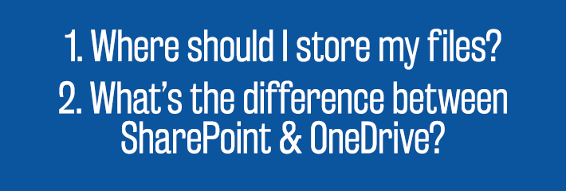
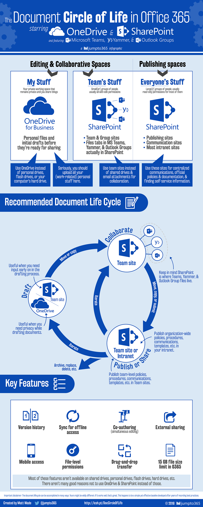

Two of the most frequently asked questions I get when it comes to SharePoint and
the Office 365 realm are:

http://icansharepoint.com/wp-content/uploads/2018/01/FAQ.png

With this post and infographic, I’m going to cover an introduction to the circle
of life of a document or file in SharePoint and Office 365. This is applicable
to SharePoint on-premises (even if you don’t have OneDrive for Business) and
SharePoint Online/OneDrive in Office 365.

Below is the infographic (click for full size) and below that is an explanation
into what I mean with it. Now, there’s a good chance you’ll have a comment,
criticism, or “wait I minute…” reaction to at least part of this.

And that’s because simplifying how documents and files go through their
lifecycles *is not a science*. This happens to be the easiest way for me to
explain what can be an excellent starting point for most organizations. So use
it as a first domino to get toward your perfect document lifecycle process.

http://icansharepoint.com/wp-content/uploads/2018/01/Document-Circle-of-Life-1500px.png

The apps
--------

OneDrive versus SharePoint: the big question. The simplest way to say it is:
OneDrive is for *my *stuff and SharePoint is for *our *stuff. Keep things in
OneDrive that are yours. Personal documents, sure. But also drafts that you’re
not ready to share with your team. When you’re ready to collaborate, get input,
ask for reviews, that’s when SharePoint comes in.

OneDrive is like the personal drive you likely have or had at work; it’s also
similar to your My Documents folder. And SharePoint is like the shared
drive/network drive/file share. I’ll get into much more detail moving forward,
but just keep that binary relationship in mind: *my *stuff versus *our* stuff.

For brevity’s sake, in this post I’m going to refer to OneDrive for Business
simply as “OneDrive”, but I mean the one that [comes with your work
account](http://icsh.pt/OneDriveTree). “SharePoint” means either SharePoint
Online or SharePoint on-prem (the general sense). “SP” means SharePoint on-prem
(2007, 2010, 2013, or 2016) and “SPO” means SharePoint Online. (Sorry, I didn’t
make these names, remember.)

If you’re using shared files in Outlook Groups, Yammer, or MS Teams, you’re
using SharePoint Online in the background. You just happen to access it and edit
files through a different interface. But it’s still a team site in SPO, plain
and simple. So, when I reference SPO, it’s also applicable to files in Outlook
Groups, Yammer, and MS Teams.

The document lifecycle
----------------------

Think about how you generally create, update, and share files. It’s usually a
three-step process, with plenty of looping of some steps. I’m going to boil it
down *really *simply first. Keep in mind that **this is a generalization of the
process** and what works for your team could be very different. Hate mail will
be forwarded to the nearest fire place. 

After years learning from various organizations on what works and what doesn’t,
I believe this process is the best way to start.

1.  Draft new files in OneDrive. Or, alternately, draft them in your team’s
    SharePoint site, but in a library or folder that’s strictly meant for
    drafting.

2.  Move or copy your file to your team’s SharePoint site (or Outlook
    Group/Yammer/Teams files). Get reviews, comments, and input there. Do not
    use OneDrive; permissions in OneDrive quickly become nightmarish.

3.  Publish your file to its intended destination. This usually means an
    intranet site (if it’s meant for all to see) or a separate library or folder
    in your team’s SharePoint site (or Outlook Group/Yammer/Teams files) for
    your team’s future use.

When updating published files, work off the last version in your team’s
SharePoint site (or Outlook Group/Yammer/Teams files) so you retain the version
history. Re-publish the updates by saving over (overwriting/uploading over) the
already-published version.

If the file is a living document (the most recent version is always the correct
one), like a status report, list of key contacts, things like that, just use the
one copy in a published zone and edit it there, in place.

Now, let’s expand on this in more detail.

Draft the new file
------------------

You generally create a file from scratch, a template, or save an older file
under a new name so you don’t have to do much rework. When you create this file,
you usually have some work to do on it before you want to share it with anyone.

When this step comes up, I almost always suggest creating or saving the new file
in your OneDrive. That way it’s only visible to you, yet still very accessible
from your browser, from OneDrive on your PC or Mac, and from your mobile device.

The main reason I suggest using OneDrive is because it’s *your *space. Nobody
else has access to it until you explicitly share the file. This prevents
colleagues from seeing a file that’s not yet ready and saves the awkward ‘early
review’ that you didn’t actually want yet. It also protects everyone else by
preventing inaccurate information from getting around prior to being confirmed
by colleagues who are responsible for that information.

That said, a SharePoint team site is perfectly fine for creating and drafting
your documents, as long as your colleagues are aware that the file is in draft
and not ready for review or dissemination yet. Basically, how much do you trust
your colleagues?

What I always push back on is creating these files in your My Documents folder
on your PC, your Desktop, a flash drive, or a personal cloud service like Google
Drive. That’s because the file isn’t easily accessible, it could be lost
forever, and the information (which could be extremely sensitive) isn’t being
kept in a safe enough space.

No offense, but if you have an Excel spreadsheet with my Social Security Number
in it, you best not be saving that file on a flash drive you can lose in a train
station or on your Google Drive, which is free (and Google owes you nothing if
something gets lost or breached).

Your OneDrive and SharePoint instances are secured either by your IT team or
Microsoft, meaning *somebody *has ensured the system is safe to keep sensitive
information. That said, it’s all together in one place, so why scatter files
across multiple systems or storage devices? In the 2010s, it simply doesn’t make
sense to save elsewhere.

Collaborate and garner feedback
-------------------------------

The next step of the document lifecycle is sharing the file with colleagues to
provide input or review. At this point, it makes sense to move the draft file
from the safe space of OneDrive to your team’s SharePoint site. You can either
make a copy or move it entirely; the former retains a copy in OneDrive while the
latter does not. That said, if your team is successfully using Outlook Groups,
Yammer, or Microsoft Teams, your file should be moved or copied to the Files tab
in the appropriate app.

At this point, you can share links to the files with your colleagues so they can
provide input and feedback. You should never attach the file to an email because
you immediately lose configuration control on their knowledge. The minute you
update the file in the future, the copy they retain in Outlook is no longer
correct.

Also, getting reviews from multiple people via email is a nightmare. Let them
all edit the master file directly and respond to each other’s comments in an
efficient way. This will save everyone time and you may retain your sanity.

So, my suggestion for files that are in review or simply need to be updated
later is to keep these files in a SharePoint team site (or Outlook Groups,
Yammer, or Teams) where permissions are restricted so only the right people see
the information (and, frankly, your reviews won’t be too crazy with so many
people).

Yes, technically you can use OneDrive to collaborate on files. However, when you
do this, you’re going to be setting up unique permissions to each file or
folder; file- and folder-level permissions quickly become a nightmare that you
will regret. SharePoint is built to have permissions based on working groups;
take advantage of this setup and don’t fall into the trap of using OneDrive as a
crutch. I’ve seen too many people take the bait and regret it later. Please
don’t become a statistic.

Publish
-------

The word *publish* can mean a lot of things, from something super formal to
simply making an update to a project plan that changes regularly. But the
concept is always the same, regardless of the formality: you’re updating
information that you or others need to do their job, and the updates *need to be
known* by the recipients to ensure the correct information is out there.

Generally, publishing happens either in an intranet site or within a team site.
Usually intranet sites are visible to the entire company; publishing here is
usually more formal and posted either on a communications feed or sent via an
all staff email. Team sites are typically only accessible to a small group of
people; publishing here usually means a simple update and maybe a quick message
to the team letting them know.

How you publish the file depends on your needs. When publishing to an intranet,
I make a copy of the file in the team site and upload it to its new home in the
intranet site. Retaining the copy in the team site means I can be working on
updates in the background with affecting the live version on the intranet site.

When publishing within a team site (i.e., only your team needs to see the file,
not everyone else), it can be useful to have a library for draft files and a
library for official resources. So I generally make a copy of the file from the
draft library and add it to the official resources library. That way, everyone
knows what’s “done” and what’s not. This is especially useful for things like
templates, internal policies, things like that. The draft version is still
available for updating without affecting the official version, can be run
through feedback loops again, then you can update the official version once the
draft is signed off/agreed to.

In both situations above, I suggest overwriting the published version of the
document each time you publish so the official version retains version history
that your viewers can see what changes have been made over time. This is your
call and sometimes organizations don’t want their viewers to be able to see past
versions, but I have yet to see a very good reason not to.

Now, for living documents—those files that are updated frequently enough and by
one or a couple dedicated owners—it clearly makes sense only have one copy of
this and update it as necessary. This is applicable to, say, key contact lists,
status reports, project task lists (and MS Project files/Gantt charts), and ad
hoc information sources.

Features
--------

And, of course, the other major reason to use OneDrive and SharePoint is because
of the great features that come with the tools. You should be aware of what the
differences between OneDrive and SharePoint are, but generally speaking,
this [infographic about document libraries](http://icsh.pt/SPDocLibs) will get
you started.
